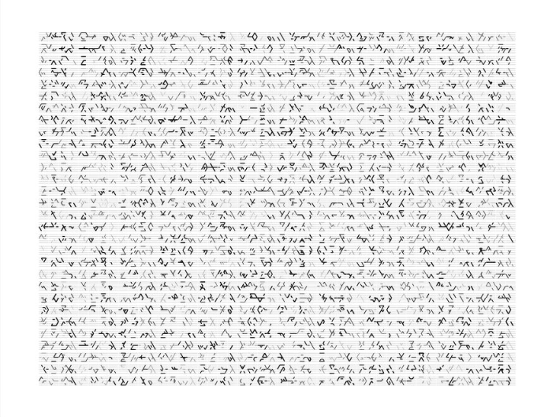
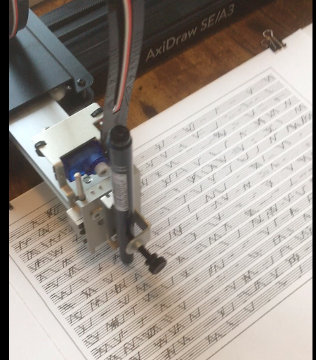
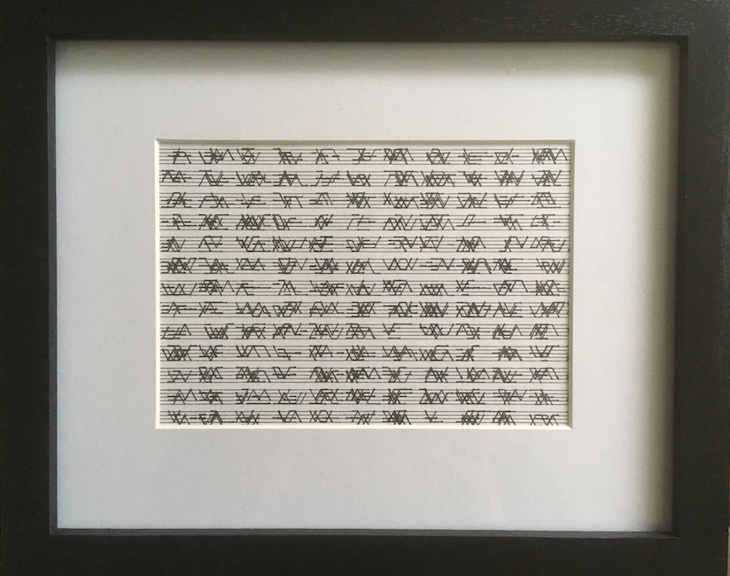

```{r setup, include=FALSE}
knitr::opts_chunk$set(echo = TRUE, message = FALSE, warning = FALSE, fig.align = "center", 
                      fig.width = 5, fig.asp = 0.618)
library(tidyr)
library(dplyr)
library(ggplot2)
library(extraDistr)
library(purrr)
library(knitr)
library(here)
```

## Vroom

```{r echo=FALSE, out.width='100%'}

```

## Introduction

This talk will cover:

- Reasons why simulations are useful
- Basics of random data in R
- Set up simulations with dplyr
- Simulating a Regression Model 
- Power calculations in A/B test
- Simulations to create *aRt*

## Introduction

In this talk:

- Focus on dplyr, tidyr, purrr, ggplot2
- Probably other ways to do this even with these tools

Other ways without these tools:

- Base R using combinations of nested for loops
- Drake package 
- Specific packages for simulations
- Others

## Why Make Simulations?

In this talk:

- Data Science educational purposes
- Power calculations of study designs
- Make aRt

Other reasons:

- Understand business processes
- Generate useful fake data
- And more

## Random Data in R

In this talk:

- *rnorm(n, mean, sd)* for continuous outcomes
- *rpois(n, lambda)* for count outcomes
- *rbinom(n, size = 1, prob)* binary outcomes

Others:

- *rchisq* continuous positive skewed
- *rexp* exponential distribution
- *rbinom(n, size = k, prob = vec)* binary outcomes
- Many more


## Random Data in R: rnorm

```{r echo = TRUE, fig.width=5, fig.asp=0.618}
data.frame(r_sample = rnorm(n = 10000, mean = 1000, sd = 250)) %>% 
  ggplot(aes(x = r_sample)) +
  geom_histogram(bins = 300) +
  geom_vline(xintercept = 1000, color = 'red') +
  theme_linedraw()
```

## Random Data in R: rpois

```{r echo = TRUE}
data.frame(r_sample = rpois(n = 10000, lambda = 3)) %>% 
  ggplot(aes(x = r_sample)) +
  geom_histogram() +
  geom_vline(xintercept = 3, color = 'red') +
  theme_linedraw()
```

## Random Data in R: rbinom

```{r echo = TRUE}
data.frame(r_sample = rbinom(n = 10000, size = 1, prob = 0.5)) %>% 
  ggplot(aes(x = r_sample)) +
  geom_histogram() +
  theme_linedraw()
```

## Simulations in dplyr: dplyr::slice

Def: Choose rows by their ordinal position in the tbl.

```{r eval = FALSE}
slice(df, c(1, 2, 3)) # rows 1, 2 ,3
slice(df, rep(c(1, 2), each = 3)) # rows 1, 1, 1, 2, 2, 2
slice(df, rep(c(1, 2), c(2, 3))) # rows 1, 1, 2, 2, 2 
```

- Simulations have nested structures with repeated obs
- For example each simu_id has 100 obs
- This saves you most of your headache while doing simulations

## Simulations in dplyr

Simulate data on 3 cars for a A/B test twice.

```{r}
n_simu <- 2; n_obs <- 3

data.frame(obs_id = 1:n_obs) 
```

## Simulations in dplyr

```{r}
n_simu <- 2; n_obs <- 3

data.frame(obs_id = 1:n_obs) %>% 
  dplyr::slice(rep(obs_id, each = n_simu)) # each n_simu times
```

## Simulations in dplyr

```{r}
n_simu <- 2; n_obs <- 3

data.frame(obs_id = 1:n_obs) %>% 
  dplyr::slice(rep(obs_id, each = n_simu)) %>% # each n_simu times
  mutate(simu_id = rep(1:n_simu, n_obs)) %>% # create simu_id
  arrange(simu_id, obs_id) %>% # obs_id are nested within simu_id
  select(simu_id, obs_id)
```

## Simulations in dplyr

```{r}
data.frame(obs_id = 1:n_obs) %>% 
  dplyr::slice(rep(obs_id, each = n_simu)) %>% 
  mutate(
    simu_id  = rep(1:n_simu, n_obs),
    pois_var = rpois(dplyr::n(), 10) # simulated online_views
  ) %>% 
  arrange(simu_id, obs_id) %>% 
  select(simu_id, obs_id, pois_var) %>% 
  rename(car_id = obs_id, online_views = pois_var)
```

## Simulating a Regression Model

To simulate a linear model you need to:

* Simulate a set of independent variables
* Define the mean as a function of the independent variables
* Simulate the outcome as a normal distribution with the defined mean

We will:

* Simulate data on online views
* Run a regression with online views as outcome
* Distribution of the effect of price on views

## Simulating a Regression Model

Simulate the number of online views.

```{r, eval = FALSE}
n_simu <- 2
n_obs <- 3

data.frame(car_id = seq(1, n_obs, 1)) %>% 
  dplyr::slice(rep(car_id, each = n_simu)) %>% 
  mutate(
    simu_id    = rep(1:n_simu, n_obs),
    price      = rpois(n(), 15), # independent variable
    miles      = rpois(n(), 25), # independent variable
    mean_views = 200 - 2*price - 2*miles, # mean(price, miles)
    num_views  = rnorm(n(), mean_views, 20) # random var with mean
  ) %>% 
  arrange(simu_id, car_id) %>% 
  select(simu_id, car_id, price, miles, mean_views, num_views) %>% 
  head(6)
```

## Simulating a Regression Model

```{r, echo = FALSE}
n_simu <- 2
n_obs <- 3

data.frame(car_id = 1:n_obs) %>% 
  dplyr::slice(rep(car_id, each = n_simu)) %>% 
  mutate(
    simu_id    = rep(1:n_simu, n_obs),
    price      = rpois(n(), 15), # independent variable
    miles      = rpois(n(), 25), # independent variable
    mean_views = 100 - 2*price - 2*miles, # mean(price, miles)
    num_views  = rnorm(n(), mean_views, 20) # random var with mean
  ) %>% 
  arrange(simu_id, car_id) %>% 
  select(simu_id, car_id, price, miles, mean_views, num_views) %>% 
  head(6)
```

## Simulating a Regression Model: tidyr::nest

- We want to apply a linear model to each simu_id
- We are going to group each simu_id in its own dataframe (tidyr::nest)
- Run the linear model separately on dataframe (purrr:map)
- Unnest the results (tidyr::unnest)

```{r, eval = FALSE}
tidyr::nest(dt, simu_id)
```

## Simulating a Regression Model: tidyr::nest

```{r, eval = FALSE}
data.frame(car_id = seq(1, n_obs, 1)) %>% 
  dplyr::slice(rep(car_id, each = n_simu)) %>% 
  mutate(
    simu_id    = rep(1:n_simu, n_obs),
    price      = rpois(n(), 15), 
    miles      = rpois(n(), 25), 
    mean_views = 200 - 2*price - 2*miles, 
    num_views  = rnorm(n(), mean_views, 20) 
  ) %>% 
  arrange(simu_id, car_id) %>% 
  select(simu_id, car_id, price, miles, mean_views, num_views) %>% 
  group_by(simu_id) %>% # needed for nest() below
  tidyr::nest() # nest the data by each simu_id
```

## Simulating a Regression Model: tidyr::nest

```{r, echo = FALSE}
n_simu <- 1000; n_obs <- 50
```

```{r}
simu_nested <- 
  data.frame(car_id = seq(1, n_obs, 1)) %>% 
  dplyr::slice(rep(car_id, each = n_simu)) %>% 
  mutate(
    simu_id    = rep(1:n_simu, n_obs),
    price      = rpois(n(), 15),
    miles      = rpois(n(), 25),
    mean_views = 200 - 2*price - 2*miles,
    num_views  = rnorm(n(), mean_views, 20)
  ) %>% 
  group_by(simu_id) %>% 
  nest()
```

## Simulating a Regression Model: tidyr::nest

```{r}
names(simu_nested)
```

```{r}
simu_nested$data[[1]] %>% 
  head(3)
```

## Simulating a Regression Model

Defining the linear model function:

```{r}
num_views_model <- function(df) {
  lm(num_views ~ price + miles, data = df)
}
```

Defining the function to get the coefficient of price:

```{r}
num_views_price_coef <- function(model) {
  as.numeric(model$coefficients[2])
}
```

## Simulating a Regression Model: Using purrr::map

The map functions transform their input by applying a function to each element and returning a vector the same length as the input.

```{r, eval = FALSE}
purrr::map(nested_df, num_views_model)
```

Run one model on each simu_id.

## Simulating a Regression Model: Using purrr::map

```{r}
simu_nested <- 
  simu_nested %>% 
  mutate(
    # Run the num_views_model on each simu_id
    model      = map(data, num_views_model),
    # After the model ran get the price coefficient
    price_coef = map(model, num_views_price_coef)
  )
```

## Simulating a Regression Model: Using purrr

```{r}
simu_nested$model[[1]]
simu_nested$price_coef[[1]]
```

## Simulating a Regression Model: tidyr::unnest

Nesting creates a list-column of data frames; unnesting flattens it back out into regular columns. 

```{r, eval = FALSE}
tidyr::unnest(nested_df, summary_df)
```


## Simulating a Regression Model: tidyr::unnest

```{r}
simu_price_coef <- 
  unnest(simu_nested, price_coef) %>% # need help with this
  select(simu_id, price_coef)

head(simu_price_coef, 3)
```

## Simulating a Regression Model: unesting

```{r}
simu_price_coef %>% 
  ggplot(aes(x = price_coef)) +
  geom_histogram() +
  theme_linedraw()
```

## Simulating a Regression Model: Summary Statistics

```{r}
simu_price_coef %>% 
  ungroup() %>%
  summarise(
    mean_price_coef = mean(price_coef),
    sd_price_coef   = sd(price_coef)
  )
```

## Power Calculation A/B Test

```{r echo=FALSE, out.width='100%'}

```

## Power Calculation A/B Test: Definitions

* Figure out the required sample size (n = ?)
* Interested in minimal difference (Views = 10)
* While controlling for the Type I error rate (5%)
* Obtaining a minimum power (90%)
* Plus assumptions about the data

## Power Calculations A/B Test

* You don't need a formula!
* Simulate the data with the assumptions and inputs
* Calculate the proportion of times p-values < Type I error rate
* That is power!

## Power Calculation A/B Test: Adjusting for Covariates

* Assumptions: 
  * Number of views is normally distributed
  * The number of views depends linearly on price and mileage of the car
  
* Inputs: 
  * New layout increases the average number of views at least by 10 views
  * Sample size
  
* Outputs:
  * The power for the given sample size

## Power Calculation A/B Test: Adjusting for Covariates

```{r, eval = FALSE}
n_simu <- 2
n_obs <- 3

data.frame(car_id = seq(1, n_obs, 1)) %>% 
  dplyr::slice(rep(car_id, each = n_simu)) %>% 
  mutate(
    simu_id    = rep(1:n_simu, n_obs),
    price      = rpois(n(), 15), 
    miles      = rpois(n(), 25), 
    treatment  = rbinom(n(), 1, 0.50), # randomized treatment
    mean_views = 200 - 2* price - 2* miles + 10*treatment,
    num_views  = rnorm(n(), mean_views, 20)
  )
```

## Power Calculation A/B Test: Adjusting for Covariates

```{r, echo = FALSE}
n_simu <- 2
n_obs <- 3

data.frame(car_id = seq(1, n_obs, 1)) %>% 
  dplyr::slice(rep(car_id, each = n_simu)) %>% 
  mutate(
    simu_id    = rep(1:n_simu, n_obs),
    price      = rpois(n(), 15), # in thousands
    miles      = rpois(n(), 25), # in thousands
    treatment  = rbinom(n(), 1, 0.50), # randomized treatment
    mean_views = 200 - 2*price - 2*miles + 10*treatment,
    num_views  = rnorm(n(), mean_views, 20)
  ) %>% 
  arrange(simu_id, car_id) %>% 
  select(simu_id, car_id, price, miles, treatment, mean_views, num_views)
```

## Power Calculation A/B Test: with and without adjustment

```{r}
num_views_model_without <- function(df) {
  lm(num_views ~ treatment, data = df)
}

num_views_model_with <- function(df) {
  lm(num_views ~ treatment + price + miles, data = df)
}

treatment_pvalue <- function(model) {
  summary(model)$coefficients[2, 4]
}
```

## Power Calculation A/B Test: with and without adjustment

```{r, echo = FALSE}
n_simu <- 1000
n_obs <- 100
```

```{r}
simu_ab <- 
  data.frame(car_id = seq(1, n_obs, 1)) %>% 
  dplyr::slice(rep(car_id, each = n_simu)) %>% 
  mutate(
    simu_id    = rep(1:n_simu, n_obs),
    price      = rpois(n(), 15),
    miles      = rpois(n(), 25),
    treatment  = rbinom(n(), 1, 0.50),
    mean_views = 200 - 2*price - 2*miles + 10*treatment,
    num_views  = rnorm(n(), mean_views, 20)
  )
```

## Power Calculation A/B Test: with and without adjustment

```{r}
simu_ab_nested <- 
  simu_ab %>% 
  group_by(simu_id) %>% 
  nest() %>% 
  mutate(
    model_without   = map(data, num_views_model_without),
    model_with      = map(data, num_views_model_with),
    pvalues_without = map(model_without, treatment_pvalue),
    pvalues_with    = map(model_with, treatment_pvalue)
  )

names(simu_ab_nested)
```

## Power Calculation A/B Test: with and without adjustment

```{r}
simu_ab_nested$model_without[[1]]$coefficients
simu_ab_nested$model_with[[1]]$coefficients
```

## Power Calculation A/B Test: with and without adjustment

```{r}
simu_ab_nested$pvalues_without[[1]]
simu_ab_nested$pvalues_with[[1]]
```

## Power Calculation A/B Test: Power of the test

```{r}
simu_ab_pvalues_without <- 
  simu_ab_nested %>% 
  unnest(pvalues_without) %>% 
  select(simu_id, pvalues_without)

simu_ab_pvalues_with <-
  simu_ab_nested %>% 
  unnest(pvalues_with) %>% 
  select(simu_id, pvalues_with) 
```

## Power Calculation A/B Test: Power of the test

```{r}
simu_ab_pvalues_with %>% 
  ungroup() %>% 
  summarise(power_with = mean(pvalues_with < 0.05)) 
```

## Power Calculation A/B Test: Power of the test

```{r}
simu_ab_pvalues_without %>% 
  ungroup() %>% 
  summarise(power_without = mean(pvalues_without < 0.05))
```

## Simulations to Create aRt: Manfred Mohr


```{r echo=FALSE, out.width='70%'}

```

## Simulations to Create aRt

```{r, warning = FALSE}
n_steps_x <- 10
n_steps_y <- 5

dots_df <- 
  data.frame(n_lines = rpois(1, 10) + 1) %>% # number of lines 
  dplyr::slice(rep(1, n_lines)) %>% 
  mutate(
    line_id      = 1:n(), # assign an id to each line
    line_x_start = sample(2:(n_steps_x - 1), n(), replace = TRUE),
    line_y_start = sample(1:n_steps_y, n(), replace = TRUE),
    line_length  = rdunif(n(), 1, 3), 
    line_thick   = rdunif(n(), 1, 5) 
  ) %>% 
  dplyr::slice(rep(line_id, line_length)) %>%
  select(-n_lines) 
```

## Simulations to Create aRt

```{r}
dots_df %>% head(4)
```

## Simulations to Create aRt

```{r}
lines_df <- 
  dots_df %>%  
  group_by(line_id) %>% 
  mutate(
    x_axis_line  = line_x_start + 0:(n() - 1),
    y_axis_steps = sample(c(-1, 1), n(), replace = TRUE),
    y_axis_line  = line_y_start + y_axis_steps
  ) %>% 
  ungroup()
```

## Simulations to Create aRt

```{r, eval = FALSE}
lines_df %>% 
  ggplot(aes(
             x = x_axis_line, 
             y = y_axis_line, 
             group = as.factor(line_id), 
             size = line_thick
         ), 
         color = 'black') +
  geom_line() +
  geom_hline(yintercept = 1, size = 0.1) + 
  geom_hline(yintercept = 2, size = 0.1) + 
  geom_hline(yintercept = 3, size = 0.1) + 
  geom_hline(yintercept = 4, size = 0.1) + 
  geom_hline(yintercept = 5, size = 0.1) + 
  ylim(1, 5) +
  theme_void() +
  theme(legend.position = 'none') 
```

## Simulations to Create aRt

```{r, echo = FALSE}
lines_df %>% 
  ggplot(aes(x = x_axis_line, y = y_axis_line, group = as.factor(line_id), size = line_thick), color = 'black') +
  geom_line() +
  geom_hline(yintercept = 1, size = 0.1) + 
  geom_hline(yintercept = 2, size = 0.1) + 
  geom_hline(yintercept = 3, size = 0.1) + 
  geom_hline(yintercept = 4, size = 0.1) + 
  geom_hline(yintercept = 5, size = 0.1) + 
  ylim(1, 5) +
  theme_void() +
  theme(legend.position = 'none') 
```

## Simulations to Create aRt

```{r, warning = FALSE, eval = FALSE}
n_squares <- 20^2
n_steps_x <- 10
n_steps_y <- 5

data.frame(squares_id = seq(1:n_squares)) %>% 
  mutate(n_lines = rpois(1, 6) + 1) %>% # number of lines 
  dplyr::slice(rep(1:n(), n_lines)) %>% 
  mutate(
    line_id      = 1:n(), # assign an id to each line
    line_x_start = sample(2:(n_steps_x - 1), n(), replace = TRUE),
    line_y_start = sample(1:n_steps_y, n(), replace = TRUE),
    line_length  = rdunif(n(), 2, 4),
    line_thick   = rdunif(n(), 1, 3) 
  ) %>% 
  dplyr::slice(rep(line_id, line_length)) %>%
  select(-n_lines) %>% 
  group_by(line_id) %>% # continues
```

## Simulations to Create aRt

```{r out.width = "100%", out.height = "100%", warning = FALSE, echo = FALSE}
n_squares <- 15^2
n_steps_x <- 10
n_steps_y <- 5

data.frame(squares_id = seq(1:n_squares)) %>% 
  mutate(n_lines = rpois(1, 6) + 1) %>% # number of lines 
  dplyr::slice(rep(1:n(), n_lines)) %>% 
  mutate(
    line_id      = 1:n(), # assign an id to each line
    line_x_start = sample(2:(n_steps_x - 1), n(), replace = TRUE), # start on x-axis
    line_y_start = sample(1:n_steps_y, n(), replace = TRUE),
    line_length  = rdunif(n(), 2, 4), # each lines gets a different length
    line_thick   = rdunif(n(), 1, 3) 
  ) %>% 
  dplyr::slice(rep(line_id, line_length)) %>% # repeat each line id by the line_length
  select(-n_lines) %>% 
  group_by(line_id) %>% 
  mutate(
    x_axis_line  = line_x_start + 0:(n() - 1),
    y_axis_steps = sample(c(-1, 1), n(), replace = TRUE),
    y_axis_line  = line_y_start + y_axis_steps
  ) %>% 
  ungroup() %>% 
  ggplot(aes(x = x_axis_line, y = y_axis_line, group = as.factor(line_id), size = line_thick), color = 'black') +
  geom_line() +
  scale_size(range = c(0.20, 0.4)) + 
  geom_hline(yintercept = 1, size = 0.1) + 
  geom_hline(yintercept = 2, size = 0.1) + 
  geom_hline(yintercept = 3, size = 0.1) + 
  geom_hline(yintercept = 4, size = 0.1) + 
  geom_hline(yintercept = 5, size = 0.1) + 
  ylim(1, 5) +
  theme_void() +
  facet_wrap(~squares_id, nrow = n_squares^0.5) +
  theme(
    legend.position = 'none',
    strip.text.x = element_blank(), # no labels with facet_wrap
    panel.spacing.x = unit(0.05, "lines"),
    panel.spacing.y = unit(0.25, "lines"),
    plot.margin = margin(0.5, 0.5, 0.5, 0.5, "cm"),
    plot.background = element_rect(
     fill = "white",
     colour = "black",
     size = 1
  )
  )
```

## Simulations to Create aRt

```{r echo=FALSE, out.width='50%'}

```

## Simulations to Create aRt

```{r echo=FALSE, out.width='75%'}

```

## Simulations to Create aRt

You can all be aRtists!

## Thank You

Special Thanks to:

- Ludmila Janda
- Jean-Francois Blanchette-Guertin

